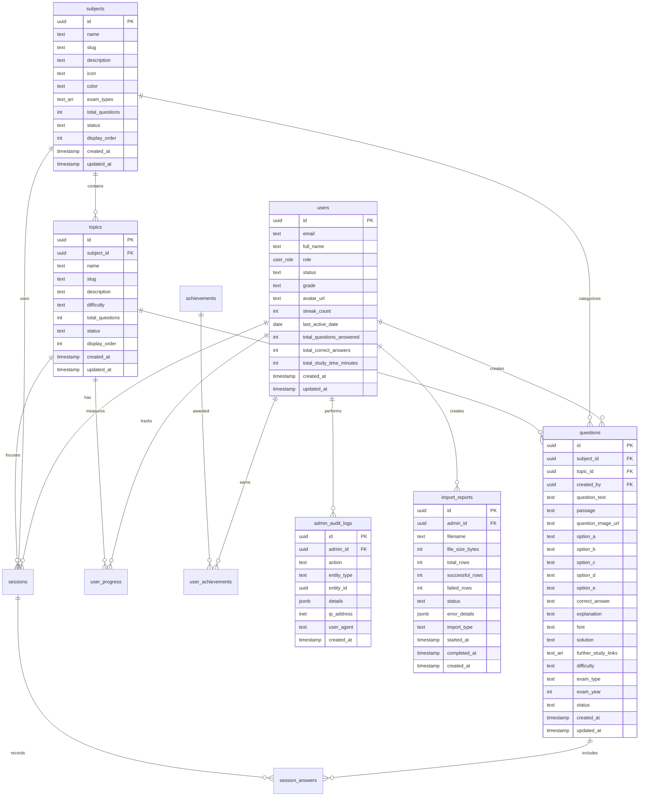
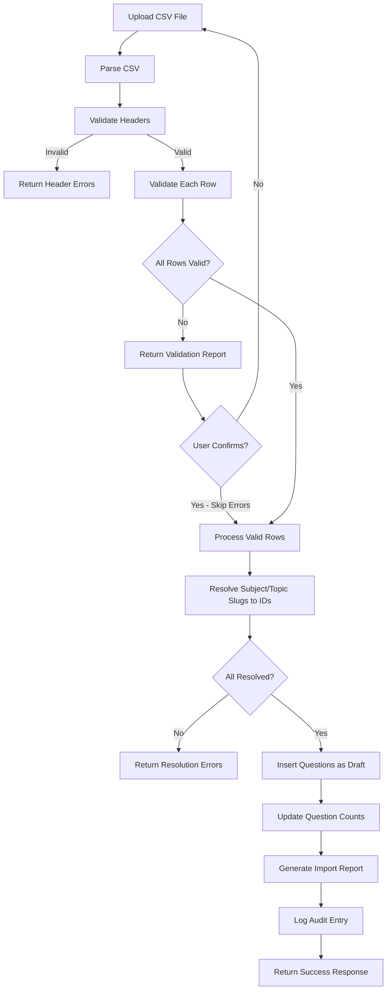
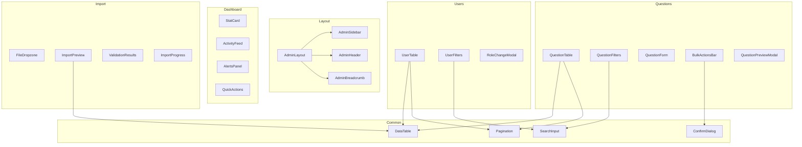

# SabiPrep Admin Portal Architecture

## Overview

This document defines the comprehensive architecture for the SabiPrep Admin Portal - a secure, role-based administrative interface for managing users, content, questions, and system monitoring.

---

## Table of Contents

1. [Database Schema Extensions](#1-database-schema-extensions)
2. [API Route Structure](#2-api-route-structure)
3. [Admin UI Route Structure](#3-admin-ui-route-structure)
4. [Security Architecture](#4-security-architecture)
5. [CSV Import Specification](#5-csv-import-specification)
6. [Component Hierarchy](#6-component-hierarchy)
7. [Implementation Phases](#7-implementation-phases)

---

## 1. Database Schema Extensions

### 1.1 User Role System

```sql
-- Migration: 20241216_admin_schema.sql

-- Create user role enum type
CREATE TYPE user_role AS ENUM ('student', 'tutor', 'admin');

-- Add role column to users table
ALTER TABLE public.users 
ADD COLUMN role user_role NOT NULL DEFAULT 'student';

-- Add status column to users table
ALTER TABLE public.users 
ADD COLUMN status TEXT NOT NULL DEFAULT 'active' 
CHECK (status IN ('active', 'suspended', 'deleted'));

-- Create index for role-based queries
CREATE INDEX idx_users_role ON public.users(role);
CREATE INDEX idx_users_status ON public.users(status);
```

### 1.2 Question Status Enhancement

```sql
-- Add status to questions table
ALTER TABLE public.questions 
ADD COLUMN status TEXT NOT NULL DEFAULT 'draft' 
CHECK (status IN ('draft', 'published', 'archived'));

-- Add passage column for comprehension questions
ALTER TABLE public.questions 
ADD COLUMN passage TEXT;

-- Add option_e for 5-option questions (optional)
ALTER TABLE public.questions 
ADD COLUMN option_e TEXT;

-- Modify correct_answer constraint for E option
ALTER TABLE public.questions 
DROP CONSTRAINT questions_correct_answer_check;

ALTER TABLE public.questions 
ADD CONSTRAINT questions_correct_answer_check 
CHECK (correct_answer IN ('A', 'B', 'C', 'D', 'E'));

-- Add solution field (detailed worked solution)
ALTER TABLE public.questions 
ADD COLUMN solution TEXT;

-- Add further_study_links
ALTER TABLE public.questions 
ADD COLUMN further_study_links TEXT[];

-- Add created_by field to track who added the question
ALTER TABLE public.questions 
ADD COLUMN created_by UUID REFERENCES public.users(id);

-- Create index for question status
CREATE INDEX idx_questions_status ON public.questions(status);
CREATE INDEX idx_questions_created_by ON public.questions(created_by);
```

### 1.3 Admin Audit Logs Table

```sql
-- Create admin_audit_logs table for tracking all admin actions
CREATE TABLE IF NOT EXISTS public.admin_audit_logs (
  id UUID PRIMARY KEY DEFAULT uuid_generate_v4(),
  admin_id UUID NOT NULL REFERENCES public.users(id) ON DELETE SET NULL,
  action TEXT NOT NULL,
  entity_type TEXT NOT NULL, -- 'user', 'question', 'subject', 'topic', 'import'
  entity_id UUID,
  details JSONB, -- Stores before/after states or additional context
  ip_address INET,
  user_agent TEXT,
  created_at TIMESTAMP WITH TIME ZONE DEFAULT NOW()
);

-- Indexes for audit log queries
CREATE INDEX idx_audit_logs_admin_id ON public.admin_audit_logs(admin_id);
CREATE INDEX idx_audit_logs_action ON public.admin_audit_logs(action);
CREATE INDEX idx_audit_logs_entity_type ON public.admin_audit_logs(entity_type);
CREATE INDEX idx_audit_logs_created_at ON public.admin_audit_logs(created_at DESC);

-- Enable RLS
ALTER TABLE public.admin_audit_logs ENABLE ROW LEVEL SECURITY;

-- Only admins can view audit logs
CREATE POLICY "Only admins can view audit logs" ON public.admin_audit_logs
  FOR SELECT USING (
    EXISTS (
      SELECT 1 FROM public.users 
      WHERE users.id = auth.uid() 
      AND users.role = 'admin'
    )
  );

-- System can insert audit logs (via service role)
CREATE POLICY "System can insert audit logs" ON public.admin_audit_logs
  FOR INSERT WITH CHECK (true);
```

### 1.4 Import Reports Table

```sql
-- Create import_reports table for CSV import history
CREATE TABLE IF NOT EXISTS public.import_reports (
  id UUID PRIMARY KEY DEFAULT uuid_generate_v4(),
  admin_id UUID NOT NULL REFERENCES public.users(id) ON DELETE SET NULL,
  filename TEXT NOT NULL,
  file_size_bytes INTEGER,
  total_rows INTEGER NOT NULL DEFAULT 0,
  successful_rows INTEGER NOT NULL DEFAULT 0,
  failed_rows INTEGER NOT NULL DEFAULT 0,
  status TEXT NOT NULL DEFAULT 'pending' 
    CHECK (status IN ('pending', 'processing', 'completed', 'failed')),
  error_details JSONB, -- Array of row-level errors
  import_type TEXT NOT NULL, -- 'questions', 'users', 'subjects', 'topics'
  started_at TIMESTAMP WITH TIME ZONE DEFAULT NOW(),
  completed_at TIMESTAMP WITH TIME ZONE,
  created_at TIMESTAMP WITH TIME ZONE DEFAULT NOW()
);

-- Indexes for import queries
CREATE INDEX idx_import_reports_admin_id ON public.import_reports(admin_id);
CREATE INDEX idx_import_reports_status ON public.import_reports(status);
CREATE INDEX idx_import_reports_created_at ON public.import_reports(created_at DESC);

-- Enable RLS
ALTER TABLE public.import_reports ENABLE ROW LEVEL SECURITY;

-- Only admins can view import reports
CREATE POLICY "Only admins can view import reports" ON public.import_reports
  FOR SELECT USING (
    EXISTS (
      SELECT 1 FROM public.users 
      WHERE users.id = auth.uid() 
      AND users.role = 'admin'
    )
  );

-- Admins can create import reports
CREATE POLICY "Admins can create import reports" ON public.import_reports
  FOR INSERT WITH CHECK (
    EXISTS (
      SELECT 1 FROM public.users 
      WHERE users.id = auth.uid() 
      AND users.role = 'admin'
    )
  );

-- Admins can update import reports
CREATE POLICY "Admins can update import reports" ON public.import_reports
  FOR UPDATE USING (
    EXISTS (
      SELECT 1 FROM public.users 
      WHERE users.id = auth.uid() 
      AND users.role = 'admin'
    )
  );
```

### 1.5 Enhanced Subject and Topic Tables

```sql
-- Add status to subjects
ALTER TABLE public.subjects 
ADD COLUMN status TEXT NOT NULL DEFAULT 'active' 
CHECK (status IN ('active', 'inactive'));

-- Add status to topics
ALTER TABLE public.topics 
ADD COLUMN status TEXT NOT NULL DEFAULT 'active' 
CHECK (status IN ('active', 'inactive'));

-- Add display_order for sorting
ALTER TABLE public.subjects 
ADD COLUMN display_order INTEGER DEFAULT 0;

ALTER TABLE public.topics 
ADD COLUMN display_order INTEGER DEFAULT 0;
```

### 1.6 Complete Entity-Relationship Diagram



---

## 2. API Route Structure

### 2.1 Admin API Endpoints Overview

```
app/
├── api/
│   └── admin/
│       ├── auth/
│       │   ├── login/route.ts          POST - Admin login
│       │   ├── logout/route.ts         POST - Admin logout
│       │   └── verify/route.ts         GET  - Verify admin session
│       │
│       ├── dashboard/
│       │   ├── stats/route.ts          GET  - Dashboard statistics
│       │   ├── alerts/route.ts         GET  - System alerts
│       │   └── activity/route.ts       GET  - Recent activity feed
│       │
│       ├── users/
│       │   ├── route.ts                GET  - List users | POST - Create user
│       │   ├── [userId]/
│       │   │   ├── route.ts            GET/PATCH/DELETE - User CRUD
│       │   │   └── role/route.ts       PATCH - Update user role
│       │   └── export/route.ts         GET  - Export users CSV
│       │
│       ├── subjects/
│       │   ├── route.ts                GET  - List | POST - Create
│       │   └── [subjectId]/
│       │       └── route.ts            GET/PATCH/DELETE - Subject CRUD
│       │
│       ├── topics/
│       │   ├── route.ts                GET  - List | POST - Create
│       │   └── [topicId]/
│       │       └── route.ts            GET/PATCH/DELETE - Topic CRUD
│       │
│       ├── questions/
│       │   ├── route.ts                GET  - List | POST - Create
│       │   ├── [questionId]/
│       │   │   ├── route.ts            GET/PATCH/DELETE - Question CRUD
│       │   │   └── status/route.ts     PATCH - Update status only
│       │   ├── bulk/
│       │   │   ├── publish/route.ts    POST - Bulk publish
│       │   │   ├── archive/route.ts    POST - Bulk archive
│       │   │   └── delete/route.ts     POST - Bulk delete
│       │   └── export/route.ts         GET  - Export questions CSV
│       │
│       ├── import/
│       │   ├── questions/route.ts      POST - Import questions CSV
│       │   ├── validate/route.ts       POST - Validate CSV before import
│       │   ├── template/route.ts       GET  - Download CSV template
│       │   └── reports/
│       │       ├── route.ts            GET  - List import reports
│       │       └── [reportId]/route.ts GET  - Get specific report
│       │
│       └── audit/
│           └── route.ts                GET  - List audit logs
```

### 2.2 API Endpoint Specifications

#### Authentication Endpoints

```typescript
// POST /api/admin/auth/login
interface AdminLoginRequest {
  email: string;
  password: string;
}

interface AdminLoginResponse {
  success: boolean;
  user?: {
    id: string;
    email: string;
    role: 'admin' | 'tutor';
    full_name: string;
  };
  error?: string;
}

// GET /api/admin/auth/verify
interface AdminVerifyResponse {
  authenticated: boolean;
  user?: {
    id: string;
    email: string;
    role: 'admin' | 'tutor';
  };
}
```

#### Dashboard Endpoints

```typescript
// GET /api/admin/dashboard/stats
interface DashboardStatsResponse {
  users: {
    total: number;
    active: number;      // Active in last 7 days
    newThisMonth: number;
    byRole: Record<string, number>;
  };
  content: {
    totalSubjects: number;
    totalTopics: number;
    totalQuestions: number;
    publishedQuestions: number;
    draftQuestions: number;
  };
  activity: {
    totalSessions: number;
    totalAnswered: number;
    averageAccuracy: number;
    sessionsToday: number;
  };
}

// GET /api/admin/dashboard/alerts
interface SystemAlert {
  id: string;
  type: 'warning' | 'error' | 'info';
  message: string;
  action?: string;
  createdAt: string;
}

interface AlertsResponse {
  alerts: SystemAlert[];
}
```

#### User Management Endpoints

```typescript
// GET /api/admin/users?page=1&limit=20&search=&role=&status=
interface UsersListParams {
  page?: number;
  limit?: number;
  search?: string;
  role?: 'student' | 'tutor' | 'admin';
  status?: 'active' | 'suspended' | 'deleted';
  sortBy?: 'created_at' | 'full_name' | 'email';
  sortOrder?: 'asc' | 'desc';
}

interface UsersListResponse {
  users: User[];
  pagination: {
    total: number;
    page: number;
    limit: number;
    totalPages: number;
  };
}

// PATCH /api/admin/users/[userId]
interface UpdateUserRequest {
  full_name?: string;
  grade?: string;
  status?: 'active' | 'suspended';
}

// PATCH /api/admin/users/[userId]/role
interface UpdateRoleRequest {
  role: 'student' | 'tutor' | 'admin';
}
```

#### Question Management Endpoints

```typescript
// GET /api/admin/questions?page=1&limit=20&subject=&topic=&status=&difficulty=
interface QuestionsListParams {
  page?: number;
  limit?: number;
  subject_id?: string;
  topic_id?: string;
  status?: 'draft' | 'published' | 'archived';
  difficulty?: 'Easy' | 'Medium' | 'Hard';
  exam_type?: string;
  search?: string;
  sortBy?: 'created_at' | 'exam_year' | 'difficulty';
  sortOrder?: 'asc' | 'desc';
}

interface QuestionsListResponse {
  questions: QuestionWithRelations[];
  pagination: {
    total: number;
    page: number;
    limit: number;
    totalPages: number;
  };
}

// POST /api/admin/questions
interface CreateQuestionRequest {
  subject_id: string;
  topic_id: string;
  question_text: string;
  passage?: string;
  option_a: string;
  option_b: string;
  option_c: string;
  option_d: string;
  option_e?: string;
  correct_answer: 'A' | 'B' | 'C' | 'D' | 'E';
  explanation?: string;
  hint?: string;
  solution?: string;
  further_study_links?: string[];
  difficulty: 'Easy' | 'Medium' | 'Hard';
  exam_type: string;
  exam_year?: number;
  status?: 'draft' | 'published';
}

// POST /api/admin/questions/bulk/publish
interface BulkActionRequest {
  question_ids: string[];
}

interface BulkActionResponse {
  success: boolean;
  affected: number;
  errors?: Array<{ id: string; error: string }>;
}
```

#### Import Endpoints

```typescript
// POST /api/admin/import/validate
interface ValidateImportRequest {
  file: File; // CSV file
}

interface ValidationResult {
  valid: boolean;
  totalRows: number;
  validRows: number;
  errors: Array<{
    row: number;
    column: string;
    message: string;
  }>;
  preview: Array<Record<string, string>>; // First 5 rows
}

// POST /api/admin/import/questions
interface ImportQuestionsRequest {
  file: File;
  options?: {
    skipDuplicates?: boolean;
    defaultStatus?: 'draft' | 'published';
    dryRun?: boolean;
  };
}

interface ImportResponse {
  reportId: string;
  status: 'processing' | 'completed' | 'failed';
  totalRows: number;
  processedRows?: number;
}
```

---

## 3. Admin UI Route Structure

### 3.1 Route Organization

```
app/
├── (admin)/
│   ├── layout.tsx                 # Admin layout with sidebar
│   ├── admin/
│   │   ├── login/
│   │   │   └── page.tsx           # Admin login page
│   │   │
│   │   ├── dashboard/
│   │   │   └── page.tsx           # Main admin dashboard
│   │   │
│   │   ├── users/
│   │   │   ├── page.tsx           # User list with filters
│   │   │   └── [userId]/
│   │   │       └── page.tsx       # User detail/edit page
│   │   │
│   │   ├── content/
│   │   │   ├── page.tsx           # Subjects overview
│   │   │   ├── subjects/
│   │   │   │   ├── page.tsx       # Subjects list
│   │   │   │   ├── new/
│   │   │   │   │   └── page.tsx   # Create subject
│   │   │   │   └── [subjectId]/
│   │   │   │       └── page.tsx   # Edit subject
│   │   │   └── topics/
│   │   │       ├── page.tsx       # Topics list
│   │   │       ├── new/
│   │   │       │   └── page.tsx   # Create topic
│   │   │       └── [topicId]/
│   │   │           └── page.tsx   # Edit topic
│   │   │
│   │   ├── questions/
│   │   │   ├── page.tsx           # Question bank list
│   │   │   ├── new/
│   │   │   │   └── page.tsx       # Create question
│   │   │   └── [questionId]/
│   │   │       └── page.tsx       # Edit question
│   │   │
│   │   ├── import/
│   │   │   ├── page.tsx           # Import interface
│   │   │   └── history/
│   │   │       └── page.tsx       # Import history
│   │   │
│   │   ├── audit/
│   │   │   └── page.tsx           # Audit logs viewer
│   │   │
│   │   └── settings/
│   │       └── page.tsx           # Admin settings
```

### 3.2 Page Specifications

#### Dashboard Page (`/admin/dashboard`)

```typescript
interface DashboardPageProps {
  // Server-side fetched data
}

// Features:
// - Key metrics cards (Users, Questions, Sessions, Accuracy)
// - Recent activity timeline
// - Quick action buttons
// - System alerts panel
// - Charts: User growth, Question distribution by subject
```

#### Users Page (`/admin/users`)

```typescript
interface UsersPageProps {
  searchParams: {
    page?: string;
    search?: string;
    role?: string;
    status?: string;
  };
}

// Features:
// - Search by name/email
// - Filter by role, status
// - Sortable columns
// - Bulk role assignment
// - Export to CSV
// - Inline status toggle
```

#### Questions Page (`/admin/questions`)

```typescript
interface QuestionsPageProps {
  searchParams: {
    page?: string;
    subject?: string;
    topic?: string;
    status?: string;
    difficulty?: string;
    exam_type?: string;
  };
}

// Features:
// - Multi-level filtering (subject -> topic)
// - Status filter (draft/published/archived)
// - Difficulty filter
// - Exam type filter
// - Bulk publish/archive/delete
// - Quick preview modal
// - Export filtered results
```

#### Import Page (`/admin/import`)

```typescript
// Features:
// - Drag-and-drop CSV upload
// - Template download button
// - Preview before import
// - Validation feedback
// - Progress indicator
// - Error report with row numbers
// - Import history link
```

### 3.3 Route Flow Diagram

```mermaid
flowchart TD
    A[/admin/login] --> B{Authenticated?}
    B -->|No| A
    B -->|Yes| C[/admin/dashboard]
    
    C --> D[/admin/users]
    C --> E[/admin/content]
    C --> F[/admin/questions]
    C --> G[/admin/import]
    C --> H[/admin/audit]
    
    D --> D1[/admin/users/userId]
    
    E --> E1[/admin/content/subjects]
    E --> E2[/admin/content/topics]
    E1 --> E1a[/admin/content/subjects/new]
    E1 --> E1b[/admin/content/subjects/subjectId]
    E2 --> E2a[/admin/content/topics/new]
    E2 --> E2b[/admin/content/topics/topicId]
    
    F --> F1[/admin/questions/new]
    F --> F2[/admin/questions/questionId]
    
    G --> G1[/admin/import/history]
```

---

## 4. Security Architecture

### 4.1 Middleware Protection

Create `middleware.ts` at the project root:

```typescript
// middleware.ts
import { createMiddlewareClient } from '@supabase/auth-helpers-nextjs';
import { NextResponse } from 'next/server';
import type { NextRequest } from 'next/server';

export async function middleware(request: NextRequest) {
  const res = NextResponse.next();
  const supabase = createMiddlewareClient({ req: request, res });

  const {
    data: { session },
  } = await supabase.auth.getSession();

  const isAdminRoute = request.nextUrl.pathname.startsWith('/admin');
  const isAdminApiRoute = request.nextUrl.pathname.startsWith('/api/admin');
  const isAdminLoginPage = request.nextUrl.pathname === '/admin/login';

  // Skip middleware for admin login page
  if (isAdminLoginPage) {
    return res;
  }

  // Protect admin routes
  if (isAdminRoute || isAdminApiRoute) {
    if (!session) {
      if (isAdminApiRoute) {
        return NextResponse.json(
          { error: 'Unauthorized' },
          { status: 401 }
        );
      }
      return NextResponse.redirect(new URL('/admin/login', request.url));
    }

    // Check if user has admin role
    const { data: user } = await supabase
      .from('users')
      .select('role')
      .eq('id', session.user.id)
      .single();

    if (!user || !['admin', 'tutor'].includes(user.role)) {
      if (isAdminApiRoute) {
        return NextResponse.json(
          { error: 'Forbidden: Admin access required' },
          { status: 403 }
        );
      }
      return NextResponse.redirect(new URL('/home', request.url));
    }
  }

  return res;
}

export const config = {
  matcher: ['/admin/:path*', '/api/admin/:path*'],
};
```

### 4.2 Extended RLS Policies

```sql
-- ============================================
-- ADMIN RLS POLICIES
-- ============================================

-- Helper function to check if user is admin
CREATE OR REPLACE FUNCTION public.is_admin()
RETURNS BOOLEAN AS $$
BEGIN
  RETURN EXISTS (
    SELECT 1 FROM public.users 
    WHERE id = auth.uid() 
    AND role = 'admin'
  );
END;
$$ LANGUAGE plpgsql SECURITY DEFINER;

-- Helper function to check if user is admin or tutor
CREATE OR REPLACE FUNCTION public.is_admin_or_tutor()
RETURNS BOOLEAN AS $$
BEGIN
  RETURN EXISTS (
    SELECT 1 FROM public.users 
    WHERE id = auth.uid() 
    AND role IN ('admin', 'tutor')
  );
END;
$$ LANGUAGE plpgsql SECURITY DEFINER;

-- Users table: Admins can view all users
CREATE POLICY "Admins can view all users" ON public.users
  FOR SELECT USING (public.is_admin());

-- Users table: Admins can update all users
CREATE POLICY "Admins can update all users" ON public.users
  FOR UPDATE USING (public.is_admin());

-- Subjects table: Admins can manage subjects
CREATE POLICY "Admins can insert subjects" ON public.subjects
  FOR INSERT WITH CHECK (public.is_admin_or_tutor());

CREATE POLICY "Admins can update subjects" ON public.subjects
  FOR UPDATE USING (public.is_admin_or_tutor());

CREATE POLICY "Admins can delete subjects" ON public.subjects
  FOR DELETE USING (public.is_admin());

-- Topics table: Admins can manage topics
CREATE POLICY "Admins can insert topics" ON public.topics
  FOR INSERT WITH CHECK (public.is_admin_or_tutor());

CREATE POLICY "Admins can update topics" ON public.topics
  FOR UPDATE USING (public.is_admin_or_tutor());

CREATE POLICY "Admins can delete topics" ON public.topics
  FOR DELETE USING (public.is_admin());

-- Questions table: Admins can manage questions
CREATE POLICY "Admins can insert questions" ON public.questions
  FOR INSERT WITH CHECK (public.is_admin_or_tutor());

CREATE POLICY "Admins can update questions" ON public.questions
  FOR UPDATE USING (public.is_admin_or_tutor());

CREATE POLICY "Admins can delete questions" ON public.questions
  FOR DELETE USING (public.is_admin());

-- Published questions visible to all authenticated users
CREATE POLICY "Users can view published questions" ON public.questions
  FOR SELECT USING (status = 'published' AND auth.uid() IS NOT NULL);

-- Admins can view all questions (draft, published, archived)
CREATE POLICY "Admins can view all questions" ON public.questions
  FOR SELECT USING (public.is_admin_or_tutor());
```

### 4.3 First Admin Setup Mechanism

Create a seed script for the first admin:

```sql
-- Migration: 20241216_first_admin_setup.sql
-- This should only be run once during initial setup

-- Create function for first admin setup
CREATE OR REPLACE FUNCTION public.setup_first_admin(admin_email TEXT)
RETURNS VOID AS $$
DECLARE
  admin_count INTEGER;
BEGIN
  -- Check if any admins exist
  SELECT COUNT(*) INTO admin_count 
  FROM public.users 
  WHERE role = 'admin';
  
  IF admin_count > 0 THEN
    RAISE EXCEPTION 'Admin already exists. Use the admin panel to create additional admins.';
  END IF;
  
  -- Promote the user with given email to admin
  UPDATE public.users 
  SET role = 'admin' 
  WHERE email = admin_email;
  
  IF NOT FOUND THEN
    RAISE EXCEPTION 'User with email % not found. Please sign up first.', admin_email;
  END IF;
  
  RAISE NOTICE 'Successfully promoted % to admin', admin_email;
END;
$$ LANGUAGE plpgsql SECURITY DEFINER;

-- Example usage (run manually after first user signup):
-- SELECT public.setup_first_admin('admin@sabiprep.com');
```

### 4.4 API Route Security Wrapper

```typescript
// lib/admin-auth.ts
import { createServerClient } from '@/lib/supabaseServer';
import { NextRequest, NextResponse } from 'next/server';

export type AdminRole = 'admin' | 'tutor';

export interface AdminUser {
  id: string;
  email: string;
  role: AdminRole;
  full_name: string;
}

export async function withAdminAuth(
  request: NextRequest,
  handler: (user: AdminUser, request: NextRequest) => Promise<NextResponse>,
  allowedRoles: AdminRole[] = ['admin', 'tutor']
): Promise<NextResponse> {
  try {
    const supabase = createServerClient();
    
    const { data: { session }, error: sessionError } = await supabase.auth.getSession();
    
    if (sessionError || !session) {
      return NextResponse.json(
        { error: 'Unauthorized' },
        { status: 401 }
      );
    }
    
    const { data: user, error: userError } = await supabase
      .from('users')
      .select('id, email, role, full_name')
      .eq('id', session.user.id)
      .single();
    
    if (userError || !user) {
      return NextResponse.json(
        { error: 'User not found' },
        { status: 404 }
      );
    }
    
    if (!allowedRoles.includes(user.role as AdminRole)) {
      return NextResponse.json(
        { error: 'Forbidden: Insufficient permissions' },
        { status: 403 }
      );
    }
    
    return handler(user as AdminUser, request);
  } catch (error) {
    console.error('Admin auth error:', error);
    return NextResponse.json(
      { error: 'Internal server error' },
      { status: 500 }
    );
  }
}
```

### 4.5 Audit Logging Helper

```typescript
// lib/audit-logger.ts
import { createServerClient } from '@/lib/supabaseServer';

export type AuditAction = 
  | 'CREATE' | 'UPDATE' | 'DELETE' 
  | 'BULK_PUBLISH' | 'BULK_ARCHIVE' | 'BULK_DELETE'
  | 'IMPORT_START' | 'IMPORT_COMPLETE' | 'IMPORT_FAILED'
  | 'ROLE_CHANGE' | 'STATUS_CHANGE';

export type EntityType = 
  | 'user' | 'question' | 'subject' | 'topic' | 'import';

export interface AuditLogEntry {
  admin_id: string;
  action: AuditAction;
  entity_type: EntityType;
  entity_id?: string;
  details?: Record<string, unknown>;
  ip_address?: string;
  user_agent?: string;
}

export async function logAdminAction(entry: AuditLogEntry): Promise<void> {
  try {
    const supabase = createServerClient();
    
    await supabase.from('admin_audit_logs').insert({
      ...entry,
      created_at: new Date().toISOString(),
    });
  } catch (error) {
    console.error('Failed to log admin action:', error);
    // Don't throw - audit logging should not block operations
  }
}
```

---

## 5. CSV Import Specification

### 5.1 Question Import Template

**Filename:** `questions_import_template.csv`

| Column Name | Required | Type | Description | Valid Values |
|-------------|----------|------|-------------|--------------|
| `subject_slug` | Yes | String | Subject slug (use slug, not ID) | `mathematics`, `english`, `physics`, etc. |
| `topic_slug` | Yes | String | Topic slug (use slug, not ID) | `algebra`, `grammar`, etc. |
| `exam_type` | Yes | String | Examination type | `JAMB`, `WAEC`, `NECO` |
| `exam_year` | No | Integer | Year of exam | `2015` - `2025` |
| `difficulty` | Yes | String | Question difficulty | `Easy`, `Medium`, `Hard` |
| `question_text` | Yes | String | The question text | Any text |
| `passage` | No | String | Reading passage for comprehension | Any text (multiline supported) |
| `option_a` | Yes | String | Option A text | Any text |
| `option_b` | Yes | String | Option B text | Any text |
| `option_c` | Yes | String | Option C text | Any text |
| `option_d` | Yes | String | Option D text | Any text |
| `option_e` | No | String | Option E text | Any text |
| `correct_answer` | Yes | String | The correct answer | `A`, `B`, `C`, `D`, `E` |
| `explanation` | No | String | Brief explanation of answer | Any text |
| `hint` | No | String | Hint for the student | Any text |
| `solution` | No | String | Detailed step-by-step solution | Any text (multiline supported) |
| `further_study_links` | No | String | Pipe-separated URLs | `url1\|url2\|url3` |

### 5.2 Sample CSV Content

```csv
subject_slug,topic_slug,exam_type,exam_year,difficulty,question_text,passage,option_a,option_b,option_c,option_d,option_e,correct_answer,explanation,hint,solution,further_study_links
mathematics,algebra,JAMB,2023,Easy,"Solve for x: 3x + 9 = 24",,x = 3,x = 5,x = 7,x = 8,,B,"Subtract 9 from both sides: 3x = 15, then divide by 3: x = 5","Start by isolating the term with x","Step 1: 3x + 9 = 24
Step 2: 3x = 24 - 9 = 15
Step 3: x = 15 / 3 = 5",https://example.com/algebra-basics
english,comprehension,WAEC,2022,Medium,"What is the main idea of the passage?","The rapid advancement of technology has transformed how we communicate. Social media platforms have connected billions of people worldwide, enabling instant communication across vast distances.",The passage discusses ancient communication methods,Technology has revolutionized global communication,Social media is harmful to society,Traditional communication is better,,B,"The passage clearly states that technology has transformed communication and connected billions of people","Focus on the first sentence of the passage",,https://example.com/reading-comprehension
```

### 5.3 Validation Rules

```typescript
// lib/csv-validator.ts

interface ValidationRule {
  field: string;
  required: boolean;
  type: 'string' | 'number' | 'enum';
  enumValues?: string[];
  minLength?: number;
  maxLength?: number;
  pattern?: RegExp;
}

const questionValidationRules: ValidationRule[] = [
  { field: 'subject_slug', required: true, type: 'string', minLength: 1 },
  { field: 'topic_slug', required: true, type: 'string', minLength: 1 },
  { field: 'exam_type', required: true, type: 'enum', enumValues: ['JAMB', 'WAEC', 'NECO'] },
  { field: 'exam_year', required: false, type: 'number' },
  { field: 'difficulty', required: true, type: 'enum', enumValues: ['Easy', 'Medium', 'Hard'] },
  { field: 'question_text', required: true, type: 'string', minLength: 10, maxLength: 5000 },
  { field: 'passage', required: false, type: 'string', maxLength: 10000 },
  { field: 'option_a', required: true, type: 'string', minLength: 1, maxLength: 1000 },
  { field: 'option_b', required: true, type: 'string', minLength: 1, maxLength: 1000 },
  { field: 'option_c', required: true, type: 'string', minLength: 1, maxLength: 1000 },
  { field: 'option_d', required: true, type: 'string', minLength: 1, maxLength: 1000 },
  { field: 'option_e', required: false, type: 'string', maxLength: 1000 },
  { field: 'correct_answer', required: true, type: 'enum', enumValues: ['A', 'B', 'C', 'D', 'E'] },
  { field: 'explanation', required: false, type: 'string', maxLength: 2000 },
  { field: 'hint', required: false, type: 'string', maxLength: 500 },
  { field: 'solution', required: false, type: 'string', maxLength: 5000 },
  { field: 'further_study_links', required: false, type: 'string' },
];
```

### 5.4 Import Process Flow



---

## 6. Component Hierarchy

### 6.1 Admin Layout Components

```
components/
├── admin/
│   ├── layout/
│   │   ├── AdminLayout.tsx           # Main admin layout wrapper
│   │   ├── AdminSidebar.tsx          # Collapsible sidebar navigation
│   │   ├── AdminHeader.tsx           # Top header with user menu
│   │   ├── AdminNav.tsx              # Navigation items
│   │   └── AdminBreadcrumb.tsx       # Breadcrumb navigation
│   │
│   ├── dashboard/
│   │   ├── StatCard.tsx              # Metric display card
│   │   ├── ActivityFeed.tsx          # Recent activity list
│   │   ├── AlertsPanel.tsx           # System alerts
│   │   ├── QuickActions.tsx          # Quick action buttons
│   │   └── charts/
│   │       ├── UserGrowthChart.tsx   # Line chart - user growth
│   │       └── QuestionDistChart.tsx # Bar chart - questions by subject
│   │
│   ├── users/
│   │   ├── UserTable.tsx             # Users data table
│   │   ├── UserFilters.tsx           # Filter controls
│   │   ├── UserRoleBadge.tsx         # Role indicator badge
│   │   ├── UserStatusToggle.tsx      # Inline status toggle
│   │   ├── UserDetailPanel.tsx       # User detail view
│   │   └── RoleChangeModal.tsx       # Role change confirmation
│   │
│   ├── content/
│   │   ├── SubjectCard.tsx           # Subject display card
│   │   ├── SubjectForm.tsx           # Create/Edit subject form
│   │   ├── TopicCard.tsx             # Topic display card
│   │   ├── TopicForm.tsx             # Create/Edit topic form
│   │   └── ContentTree.tsx           # Hierarchical subject/topic view
│   │
│   ├── questions/
│   │   ├── QuestionTable.tsx         # Questions data table
│   │   ├── QuestionFilters.tsx       # Multi-level filter controls
│   │   ├── QuestionForm.tsx          # Create/Edit question form
│   │   ├── QuestionPreviewModal.tsx  # Quick preview popup
│   │   ├── QuestionStatusBadge.tsx   # Draft/Published/Archived badge
│   │   ├── BulkActionsBar.tsx        # Bulk action toolbar
│   │   └── RichTextEditor.tsx        # Rich text for explanations
│   │
│   ├── import/
│   │   ├── FileDropzone.tsx          # Drag-and-drop upload area
│   │   ├── ImportPreview.tsx         # Data preview table
│   │   ├── ValidationResults.tsx     # Validation error display
│   │   ├── ImportProgress.tsx        # Progress indicator
│   │   ├── ImportReport.tsx          # Final import report
│   │   └── ImportHistory.tsx         # Import history list
│   │
│   ├── audit/
│   │   ├── AuditLogTable.tsx         # Audit log data table
│   │   ├── AuditLogFilters.tsx       # Filter by admin, action, entity
│   │   └── AuditLogDetail.tsx        # Detailed log view
│   │
│   └── common/
│       ├── AdminButton.tsx           # Admin-styled button
│       ├── AdminInput.tsx            # Admin-styled input
│       ├── AdminSelect.tsx           # Admin-styled select
│       ├── AdminModal.tsx            # Modal component
│       ├── DataTable.tsx             # Reusable data table
│       ├── Pagination.tsx            # Pagination controls
│       ├── SearchInput.tsx           # Search with debounce
│       ├── ConfirmDialog.tsx         # Confirmation modal
│       ├── EmptyState.tsx            # Empty state display
│       └── LoadingSpinner.tsx        # Loading indicator
```

### 6.2 Component Dependencies Diagram



### 6.3 Key Component Specifications

#### AdminLayout Component

```typescript
// components/admin/layout/AdminLayout.tsx
interface AdminLayoutProps {
  children: React.ReactNode;
}

// Features:
// - Responsive sidebar (collapsible on mobile)
// - User profile dropdown
// - Breadcrumb navigation
// - Dark/light mode toggle
// - Session timeout warning
```

#### DataTable Component

```typescript
// components/admin/common/DataTable.tsx
interface DataTableProps<T> {
  data: T[];
  columns: ColumnDef<T>[];
  isLoading?: boolean;
  selectable?: boolean;
  onSelectionChange?: (selected: T[]) => void;
  onRowClick?: (row: T) => void;
  emptyMessage?: string;
}

// Features:
// - Sortable columns
// - Row selection with checkboxes
// - Loading skeleton
// - Empty state
// - Custom cell renderers
```

#### QuestionForm Component

```typescript
// components/admin/questions/QuestionForm.tsx
interface QuestionFormProps {
  initialData?: Question;
  onSubmit: (data: QuestionFormData) => Promise<void>;
  onCancel: () => void;
  subjects: Subject[];
}

// Features:
// - Dynamic topic loading based on subject
// - Rich text editor for explanation/solution
// - Image upload for question
// - Preview mode
// - Validation feedback
// - Auto-save draft
```

#### FileDropzone Component

```typescript
// components/admin/import/FileDropzone.tsx
interface FileDropzoneProps {
  onFileAccepted: (file: File) => void;
  acceptedTypes?: string[];
  maxSize?: number;
  disabled?: boolean;
}

// Features:
// - Drag-and-drop interface
// - Click to browse
// - File type validation
// - Size limit enforcement
// - Visual feedback for drag state
```

---

## 7. Implementation Phases

### Phase 1: Foundation (Week 1)

```
[ ] Database schema migration
    [ ] Create user role enum and add to users table
    [ ] Add status column to users, questions, subjects, topics
    [ ] Create admin_audit_logs table
    [ ] Create import_reports table
    [ ] Update RLS policies
    [ ] Create helper functions (is_admin, is_admin_or_tutor)
    
[ ] Basic admin authentication
    [ ] Create middleware.ts for admin route protection
    [ ] Create admin auth context/hooks
    [ ] Create admin login page
    [ ] Create admin logout functionality
    
[ ] Admin layout
    [ ] Create AdminLayout component
    [ ] Create AdminSidebar component
    [ ] Create AdminHeader component
    [ ] Basic navigation structure
```

### Phase 2: User Management (Week 2)

```
[ ] User management API routes
    [ ] GET /api/admin/users (list with pagination)
    [ ] GET /api/admin/users/[userId]
    [ ] PATCH /api/admin/users/[userId]
    [ ] PATCH /api/admin/users/[userId]/role
    [ ] GET /api/admin/users/export
    
[ ] User management UI
    [ ] User list page with DataTable
    [ ] User filters component
    [ ] User detail page
    [ ] Role change modal
    [ ] Status toggle
    
[ ] First admin setup
    [ ] Create setup script
    [ ] Document setup process
```

### Phase 3: Content Management (Week 3)

```
[ ] Subject/Topic API routes
    [ ] CRUD for subjects
    [ ] CRUD for topics
    
[ ] Subject/Topic UI
    [ ] Subject list page
    [ ] Subject create/edit form
    [ ] Topic list page
    [ ] Topic create/edit form
    [ ] Content tree view
```

### Phase 4: Question Management (Week 3-4)

```
[ ] Question API routes
    [ ] GET /api/admin/questions (list with filters)
    [ ] POST /api/admin/questions
    [ ] GET/PATCH/DELETE /api/admin/questions/[questionId]
    [ ] Bulk action endpoints
    
[ ] Question UI
    [ ] Question list with filters
    [ ] Question form (create/edit)
    [ ] Question preview modal
    [ ] Bulk actions bar
    [ ] Rich text editor integration
```

### Phase 5: CSV Import (Week 4-5)

```
[ ] Import API routes
    [ ] POST /api/admin/import/validate
    [ ] POST /api/admin/import/questions
    [ ] GET /api/admin/import/template
    [ ] GET /api/admin/import/reports
    
[ ] Import UI
    [ ] File dropzone
    [ ] Validation results display
    [ ] Import preview
    [ ] Progress indicator
    [ ] Import history page
    
[ ] CSV processing
    [ ] CSV parser implementation
    [ ] Validation engine
    [ ] Slug-to-ID resolver
    [ ] Batch insert logic
```

### Phase 6: Dashboard & Audit (Week 5)

```
[ ] Dashboard API routes
    [ ] GET /api/admin/dashboard/stats
    [ ] GET /api/admin/dashboard/alerts
    [ ] GET /api/admin/dashboard/activity
    
[ ] Dashboard UI
    [ ] Stat cards
    [ ] Charts (user growth, question distribution)
    [ ] Activity feed
    [ ] Alerts panel
    
[ ] Audit system
    [ ] Audit logging integration in all API routes
    [ ] Audit log viewer page
    [ ] Filter and search functionality
```

### Phase 7: Polish & Testing (Week 6)

```
[ ] Testing
    [ ] Unit tests for validation logic
    [ ] Integration tests for API routes
    [ ] E2E tests for critical flows
    
[ ] Documentation
    [ ] API documentation
    [ ] Admin user guide
    [ ] CSV template documentation
    
[ ] Performance optimization
    [ ] Query optimization
    [ ] Caching strategies
    [ ] Lazy loading
```

---

## Appendix A: TypeScript Types

```typescript
// types/admin.ts

export type UserRole = 'student' | 'tutor' | 'admin';
export type UserStatus = 'active' | 'suspended' | 'deleted';
export type QuestionStatus = 'draft' | 'published' | 'archived';
export type ImportStatus = 'pending' | 'processing' | 'completed' | 'failed';

export interface AdminUser {
  id: string;
  email: string;
  full_name: string;
  role: UserRole;
  status: UserStatus;
  grade?: string;
  avatar_url?: string;
  streak_count: number;
  total_questions_answered: number;
  created_at: string;
  updated_at: string;
}

export interface AdminQuestion {
  id: string;
  subject_id: string;
  topic_id: string;
  question_text: string;
  passage?: string;
  question_image_url?: string;
  option_a: string;
  option_b: string;
  option_c: string;
  option_d: string;
  option_e?: string;
  correct_answer: 'A' | 'B' | 'C' | 'D' | 'E';
  explanation?: string;
  hint?: string;
  solution?: string;
  further_study_links?: string[];
  difficulty: 'Easy' | 'Medium' | 'Hard';
  exam_type: string;
  exam_year?: number;
  status: QuestionStatus;
  created_by?: string;
  created_at: string;
  updated_at: string;
  // Joined data
  subject?: { name: string; slug: string };
  topic?: { name: string; slug: string };
  creator?: { full_name: string };
}

export interface AdminAuditLog {
  id: string;
  admin_id: string;
  action: string;
  entity_type: string;
  entity_id?: string;
  details?: Record<string, unknown>;
  ip_address?: string;
  user_agent?: string;
  created_at: string;
  // Joined data
  admin?: { full_name: string; email: string };
}

export interface ImportReport {
  id: string;
  admin_id: string;
  filename: string;
  file_size_bytes?: number;
  total_rows: number;
  successful_rows: number;
  failed_rows: number;
  status: ImportStatus;
  error_details?: ImportError[];
  import_type: string;
  started_at: string;
  completed_at?: string;
  created_at: string;
  // Joined data
  admin?: { full_name: string };
}

export interface ImportError {
  row: number;
  column?: string;
  message: string;
  value?: string;
}

export interface PaginationParams {
  page: number;
  limit: number;
}

export interface PaginatedResponse<T> {
  data: T[];
  pagination: {
    total: number;
    page: number;
    limit: number;
    totalPages: number;
  };
}
```

---

## Appendix B: Environment Variables

```env
# .env.local additions for admin portal

# Admin-specific settings
NEXT_PUBLIC_ADMIN_EMAIL=admin@sabiprep.com

# Supabase Service Role Key (for server-side admin operations)
SUPABASE_SERVICE_ROLE_KEY=your-service-role-key

# Optional: Admin session timeout (minutes)
ADMIN_SESSION_TIMEOUT=60
```

---

**Document Version:** 1.0  
**Last Updated:** 2025-12-16  
**Author:** Claude (AI Assistant)  
**Status:** Ready for Review
