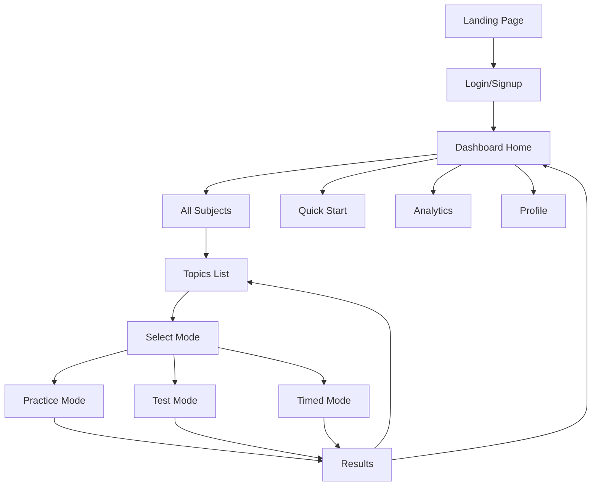

# SabiPrep Navigation & UI Redesign Plan

## Executive Summary
Redesign the navigation and UI to be more sophisticated, mature, and user-friendly. Users should immediately understand what the app offers, where they can go, and how to get there.

---

## Current Issues Identified

### 1. Navigation Problems
- **Broken links**: Home page links to `/subjects/${subject.id}` but should link to `/topics/${subject.id}`
- **No hamburger menu** on mobile for full navigation
- **No sidebar navigation** on desktop
- **No breadcrumbs** to show where users are in the app hierarchy
- **No landing page** - new users go straight to login without seeing what the app offers

### 2. UI/UX Issues  
- **Childish appearance**: Uses emojis heavily, bright colors, playful aesthetic
- **Font is basic**: Arial/Helvetica doesn't feel modern or sophisticated
- **No feature discovery**: Users don't know what modes (Practice/Test/Timed) exist until deep in the flow
- **Missing context**: No clear indication of app capabilities or user journey

### 3. User Flow Problems
- Users can't preview the app before signing up
- No onboarding flow showing features
- Learning modes are hidden until you select a topic
- No way to explore subjects without logging in

---

## Proposed Solutions

### Phase 1: Typography & Design System

#### Typography Upgrade
```css
/* Primary Font: Inter (clean, professional, modern) */
/* Accent Font: Satoshi or DM Sans (for headings) */

font-family: 'Inter', system-ui, sans-serif;
```

#### Color Palette (Sophisticated)
```css
:root {
  /* Primary - Deep Indigo */
  --primary-50: #eef2ff;
  --primary-100: #e0e7ff;
  --primary-500: #6366f1;
  --primary-600: #4f46e5;
  --primary-700: #4338ca;
  --primary-900: #312e81;
  
  /* Neutral - Slate (more sophisticated than gray) */
  --slate-50: #f8fafc;
  --slate-100: #f1f5f9;
  --slate-200: #e2e8f0;
  --slate-600: #475569;
  --slate-800: #1e293b;
  --slate-900: #0f172a;
  
  /* Success - Emerald */
  --success-500: #10b981;
  
  /* Warning - Amber */
  --warning-500: #f59e0b;
  
  /* Accent - Cyan for highlights */
  --accent-500: #06b6d4;
}
```

### Phase 2: Navigation Architecture

#### Mobile Navigation (Bottom Tab + Hamburger)
```
┌────────────────────────────────────┐
│ ☰ SabiPrep              🔔  👤    │  ← Header with hamburger
├────────────────────────────────────┤
│                                    │
│         Page Content               │
│                                    │
├────────────────────────────────────┤
│   🏠    📚    ⚡    📊    👤      │  ← Bottom tabs (5 items)
│  Home  Learn Quick Stats Profile   │
└────────────────────────────────────┘
```

#### Hamburger Menu Contents (Slide-out Drawer)
```
┌──────────────────┐
│  ✕               │
│                  │
│  📚 Subjects     │ → All subjects list
│  ⚡ Quick Start  │ → Random topic practice
│  📊 Analytics    │ → Full stats view
│  🏆 Achievements │ → Badges & rewards
│  ⚙️ Settings     │ → Preferences
│  ❓ Help         │ → FAQ & tutorials
│  ──────────────  │
│  🔓 Logout       │
└──────────────────┘
```

#### Desktop Navigation (Sidebar)
```
┌────────┬─────────────────────────────┐
│        │                             │
│  S     │                             │
│  A     │                             │
│  B     │      Page Content           │
│  I     │                             │
│  P     │                             │
│  R     │                             │
│  E     │                             │
│  P     │                             │
│        │                             │
├────────┤                             │
│ 🏠 Home│                             │
│ 📚 Sub │                             │
│ ⚡ Qui │                             │
│ 📊 Sta │                             │
│ 👤 Pro │                             │
└────────┴─────────────────────────────┘
```

### Phase 3: Landing Page (Before Login)

#### Hero Section
```
┌─────────────────────────────────────────────┐
│                                             │
│      Master Your WAEC, JAMB & NECO          │
│           with Smart Practice               │
│                                             │
│   [ Get Started ]    [ Explore Subjects ]   │
│                                             │
│      ⭐ 10,000+ Questions                   │
│      📚 All Major Subjects                  │
│      🎯 3 Learning Modes                    │
│                                             │
└─────────────────────────────────────────────┘
```

#### Feature Cards
```
┌─────────────┐ ┌─────────────┐ ┌─────────────┐
│   Practice  │ │    Test     │ │   Timed     │
│    Mode     │ │    Mode     │ │   Mode      │
│             │ │             │ │             │
│ Learn at    │ │ Simulate    │ │ Race the    │
│ your pace   │ │ real exams  │ │ clock       │
│ with hints  │ │ no hints    │ │ build speed │
└─────────────┘ └─────────────┘ └─────────────┘
```

### Phase 4: Breadcrumbs & Context

#### Breadcrumb Component
```
Home > Mathematics > Algebra > Practice Mode
```

#### Page Headers with Context
```
┌─────────────────────────────────────────────┐
│  ← Back                                     │
│                                             │
│  Algebra                                    │
│  Mathematics • 45 questions • Medium        │
│                                             │
│  [ Practice ] [ Test ] [ Timed ]            │
│                                             │
└─────────────────────────────────────────────┘
```

### Phase 5: Feature Discovery

#### Quick Actions on Home
```
┌─────────────────────────────────────────────┐
│  Quick Start                                │
│                                             │
│  ┌─────────┐ ┌─────────┐ ┌─────────┐       │
│  │ 🎯      │ │ ⏱️      │ │ 📝      │       │
│  │ Random  │ │ 5-min   │ │ Daily   │       │
│  │ Practice│ │ Sprint  │ │ Challenge│      │
│  └─────────┘ └─────────┘ └─────────┘       │
└─────────────────────────────────────────────┘
```

#### Mode Selection Cards (Improved)
```
┌─────────────────────────────────────────────┐
│  Choose Your Mode                           │
│                                             │
│  ┌───────────────────────────────────────┐ │
│  │ 📖 PRACTICE                           │ │
│  │ Take your time, use hints & solutions │ │
│  │ Perfect for learning new topics       │ │
│  │                            [ Start ]  │ │
│  └───────────────────────────────────────┘ │
│                                             │
│  ┌───────────────────────────────────────┐ │
│  │ 📝 TEST                               │ │
│  │ No hints, see results at the end      │ │
│  │ Simulate real exam conditions         │ │
│  │                            [ Start ]  │ │
│  └───────────────────────────────────────┘ │
│                                             │
│  ┌───────────────────────────────────────┐ │
│  │ ⏱️ TIMED                              │ │
│  │ Beat the clock, earn bonus points     │ │
│  │ Build speed and confidence            │ │
│  │                            [ Start ]  │ │
│  └───────────────────────────────────────┘ │
└─────────────────────────────────────────────┘
```

---

## Component Changes Required

### New Components
1. `NavigationDrawer.tsx` - Hamburger menu slide-out
2. `Sidebar.tsx` - Desktop sidebar navigation
3. `Header.tsx` - Unified header with hamburger
4. `Breadcrumbs.tsx` - Navigation breadcrumbs
5. `LandingPage.tsx` - Pre-login marketing page
6. `FeatureCard.tsx` - Mode/feature showcase cards
7. `QuickActions.tsx` - Quick start section

### Modified Components
1. `BottomNav.tsx` - Add 5th tab (Quick/Sprint mode)
2. `Card.tsx` - More sophisticated styling
3. `Button.tsx` - Refined styling
4. `Badge.tsx` - Cleaner look

### File Changes
1. `app/globals.css` - New typography, colors
2. `tailwind.config.ts` - Custom font family, colors
3. `app/page.tsx` - Landing page instead of redirect
4. `app/(dashboard)/home/page.tsx` - Add quick actions
5. `app/(learning)/mode-select/[topicId]/page.tsx` - Better mode cards

---

## Navigation Flow Diagram



---

## Implementation Priority

### High Priority (Week 1)
1. ✅ Fix broken link: `/subjects/${id}` → `/topics/${id}`
2. Add Inter font family
3. Create landing page
4. Implement hamburger menu + drawer
5. Add breadcrumbs component

### Medium Priority (Week 2)  
6. Desktop sidebar navigation
7. Upgrade color palette
8. Better mode selection cards
9. Quick actions section
10. Feature discovery cards

### Lower Priority (Week 3)
11. Onboarding flow
12. Animation refinements
13. Dark mode support
14. Achievement badges
15. Help & tutorial system

---

## Design Tokens (CSS Variables)

```css
:root {
  /* Typography */
  --font-primary: 'Inter', system-ui, -apple-system, sans-serif;
  --font-display: 'Plus Jakarta Sans', var(--font-primary);
  
  /* Font Sizes */
  --text-xs: 0.75rem;
  --text-sm: 0.875rem;
  --text-base: 1rem;
  --text-lg: 1.125rem;
  --text-xl: 1.25rem;
  --text-2xl: 1.5rem;
  --text-3xl: 1.875rem;
  
  /* Spacing */
  --space-1: 0.25rem;
  --space-2: 0.5rem;
  --space-3: 0.75rem;
  --space-4: 1rem;
  --space-6: 1.5rem;
  --space-8: 2rem;
  
  /* Border Radius */
  --radius-sm: 0.375rem;
  --radius-md: 0.5rem;
  --radius-lg: 0.75rem;
  --radius-xl: 1rem;
  --radius-2xl: 1.25rem;
  
  /* Shadows */
  --shadow-sm: 0 1px 2px 0 rgb(0 0 0 / 0.05);
  --shadow-md: 0 4px 6px -1px rgb(0 0 0 / 0.1);
  --shadow-lg: 0 10px 15px -3px rgb(0 0 0 / 0.1);
  
  /* Transitions */
  --transition-fast: 150ms ease;
  --transition-base: 200ms ease;
  --transition-slow: 300ms ease;
}
```

---

## Success Metrics

1. **Navigation clarity**: Users can find any feature in < 3 clicks
2. **Feature discovery**: 80% of users try all 3 learning modes
3. **Reduced bounce rate**: Users who see landing page are 50% more likely to sign up
4. **Professional perception**: User feedback indicates "sophisticated" and "trustworthy"
