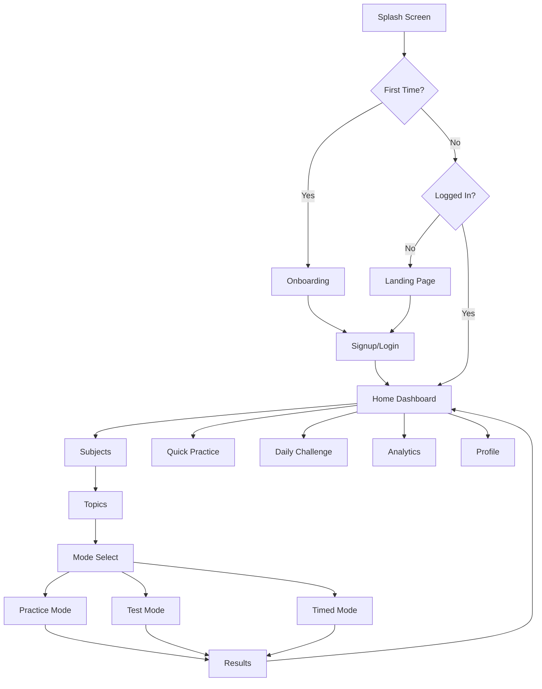

# SabiPrep Screens Implementation Plan

## Overview
This document compares the required screens against the current implementation and outlines the work needed to ensure all screens are available, navigation is straightforward, and the layout is clean and classic.

---

## Screen Audit

### ✅ Implemented Screens

| Screen | Route | Status | Notes |
|--------|-------|--------|-------|
| **Landing Page** | `/` | ✅ Complete | Shows features, learning modes, CTAs |
| **Login** | `/login` | ✅ Complete | Email/password auth, needs Google SSO |
| **Signup** | `/signup` | ✅ Complete | Registration form |
| **Home Dashboard** | `/home` | ✅ Complete | Streak, stats, quick actions, subjects |
| **Subject Selection** | `/subjects` | ✅ Complete | Browse all subjects with progress |
| **Topic Navigator** | `/topics/[subjectId]` | ✅ Complete | Topics with progress indicators |
| **Mode Selection** | `/mode-select/[topicId]` | ✅ Complete | Practice/Test/Timed with question count |
| **Practice Mode** | `/practice/[sessionId]` | ✅ Complete | Hints, solutions, navigation |
| **Test Mode** | `/test/[sessionId]` | ✅ Complete | Exam simulation |
| **Timed Mode** | `/timed/[sessionId]` | ✅ Complete | Countdown timer |
| **Results Screen** | `/results/[sessionId]` | ✅ Complete | Score breakdown, recommendations |
| **Analytics Dashboard** | `/analytics` | ✅ Complete | Weekly activity, performance |
| **Profile** | `/profile` | ✅ Complete | User info, achievements, subscription |

### ⚠️ Needs Enhancement

| Screen | Issue | Enhancement Needed |
|--------|-------|-------------------|
| **Splash Screen** | Missing | Add animated loading with brand intro |
| **Onboarding** | Missing | First-time user value proposition flow |
| **Login** | Partial | Add Google SSO button |
| **Timed Mode** | Basic | Add circular countdown timer |
| **Test Mode** | Basic | Add question navigator sidebar |

### ❌ Missing Screens (from Navigation Drawer)

| Screen | Route | Priority |
|--------|-------|----------|
| Quick Practice | `/quick-practice` | High |
| Daily Challenge | `/daily-challenge` | Medium |
| Achievements | `/achievements` | Medium |
| Leaderboard | `/leaderboard` | Low |
| Settings | `/settings` | Medium |
| Notifications | `/notifications` | Low |
| Help Center | `/help` | Low |
| About | `/about` | Low |
| Privacy | `/privacy` | Low |

---

## Implementation Plan

### Phase 1: Core Screen Enhancements (Priority: High)

#### 1.1 Splash Screen
**Location:** `app/page.tsx` (enhance existing loading state)

```
Features:
- Animated SabiPrep logo with gradient
- Loading progress indicator
- Smooth transition to landing/home
- 2-3 second display time
```

#### 1.2 Onboarding Flow
**Location:** `app/(auth)/onboarding/page.tsx` (new)

```
Screens:
1. Welcome - "Master Your Exams with SabiPrep"
2. Features - Show 3 learning modes
3. Subjects - WAEC, JAMB, NECO coverage
4. Get Started - Sign up CTA

Features:
- Swipeable carousel
- Progress dots
- Skip button
- Animated illustrations
```

#### 1.3 Google SSO
**Location:** `app/(auth)/login/page.tsx` (enhance)

```
Features:
- Google sign-in button
- Divider "or continue with email"
- Supabase Google OAuth integration
```

### Phase 2: Learning Mode Enhancements (Priority: High)

#### 2.1 Timed Mode - Circular Timer
**Location:** `app/(learning)/timed/[sessionId]/page.tsx`

```
Features:
- SVG circular progress timer
- Color changes (green → yellow → red)
- Pulse animation on low time
- Auto-advance on timeout
```

#### 2.2 Test Mode - Question Navigator
**Location:** `app/(learning)/test/[sessionId]/page.tsx`

```
Features:
- Sidebar/bottom sheet with question grid
- Color-coded: answered, unanswered, flagged
- Jump to any question
- Review mode at end
```

### Phase 3: Missing Pages (Priority: Medium)

#### 3.1 Quick Practice Page
**Location:** `app/(learning)/quick-practice/page.tsx`

```
Features:
- Random subject/topic selection
- Quick 10-question session
- Instant start button
- Recent quick practice history
```

#### 3.2 Daily Challenge Page
**Location:** `app/(dashboard)/daily-challenge/page.tsx`

```
Features:
- Today's challenge card
- Countdown to next challenge
- Streak bonus display
- Leaderboard preview
```

#### 3.3 Achievements Page
**Location:** `app/(dashboard)/achievements/page.tsx`

```
Features:
- Achievement grid with badges
- Locked/unlocked states
- Progress toward next achievement
- Share achievement option
```

#### 3.4 Settings Page
**Location:** `app/(dashboard)/settings/page.tsx`

```
Features:
- Notification preferences
- Theme toggle (future)
- Account settings
- Data & privacy
- About app
```

### Phase 4: Polish & Consistency (Priority: Medium)

#### 4.1 Consistent Header Component
- Use `Header` component across all pages
- Hamburger menu always accessible
- Back navigation where appropriate

#### 4.2 Consistent Loading States
- Skeleton loaders instead of spinners
- Consistent animation timing
- Brand-colored loading indicators

#### 4.3 Consistent Empty States
- Friendly illustrations
- Clear call-to-action
- Consistent messaging

---

## Navigation Flow



---

## Design Consistency Checklist

### Typography
- [x] Font: Inter for body, Plus Jakarta Sans for headings
- [x] Consistent heading sizes (text-2xl, text-lg, text-sm)
- [x] Proper line heights and letter spacing

### Colors
- [x] Primary: Indigo (#4f46e5)
- [x] Accent: Teal (#06b6d4)
- [x] Success: Emerald
- [x] Warning: Amber
- [x] Error: Red
- [x] Neutral: Slate

### Spacing
- [x] Container padding: px-4 (mobile), px-6 (tablet), px-8 (desktop)
- [x] Section spacing: space-y-6
- [x] Card padding: p-4 to p-6

### Components
- [x] Cards with rounded-xl, shadow-soft
- [x] Buttons with consistent sizing
- [x] Badges for status indicators
- [x] Progress bars for completion

### Navigation
- [x] Bottom nav for main sections
- [x] Hamburger menu for all pages
- [x] Back button where needed
- [x] Breadcrumbs (future enhancement)

---

## Implementation Priority

### Week 1: Critical
1. ✅ Fix build errors
2. ✅ Enhanced navigation drawer
3. [ ] Splash screen animation
4. [ ] Onboarding flow
5. [ ] Google SSO

### Week 2: Important
1. [ ] Circular timer for timed mode
2. [ ] Question navigator for test mode
3. [ ] Quick practice page
4. [ ] Daily challenge page

### Week 3: Nice to Have
1. [ ] Achievements page
2. [ ] Settings page
3. [ ] Leaderboard page
4. [ ] Help/About pages

---

## Files to Create/Modify

### New Files
```
app/(auth)/onboarding/page.tsx
app/(learning)/quick-practice/page.tsx
app/(dashboard)/daily-challenge/page.tsx
app/(dashboard)/achievements/page.tsx
app/(dashboard)/settings/page.tsx
app/(dashboard)/leaderboard/page.tsx
app/(dashboard)/notifications/page.tsx
app/(dashboard)/help/page.tsx
app/(dashboard)/about/page.tsx
app/(dashboard)/privacy/page.tsx
components/common/CircularTimer.tsx
components/common/QuestionNavigator.tsx
components/onboarding/OnboardingSlide.tsx
```

### Files to Modify
```
app/page.tsx - Add splash screen animation
app/(auth)/login/page.tsx - Add Google SSO
app/(learning)/timed/[sessionId]/page.tsx - Add circular timer
app/(learning)/test/[sessionId]/page.tsx - Add question navigator
```

---

## Next Steps

1. **Switch to Code mode** to implement the splash screen and onboarding
2. Create the missing placeholder pages
3. Enhance the timed and test modes
4. Add Google SSO integration
5. Final polish and consistency pass
