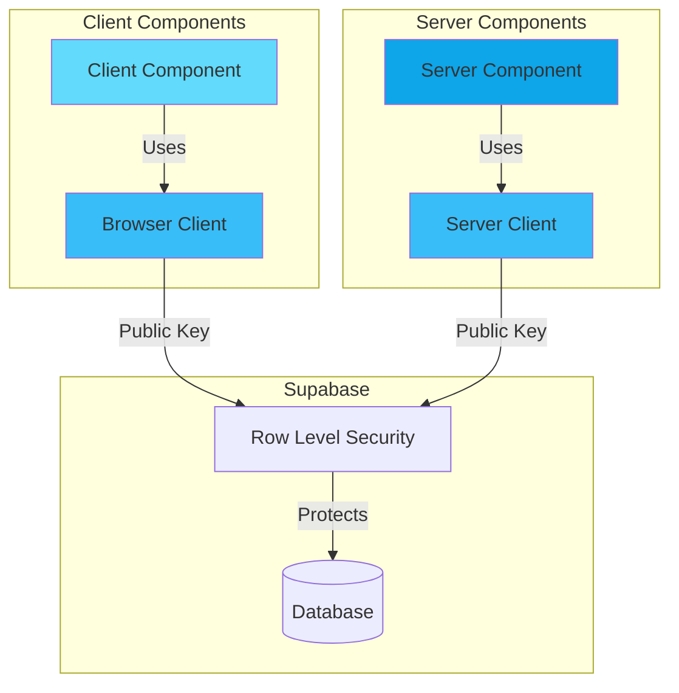

# Supabase Server Components Implementation Plan

## Current State Analysis

### Existing Setup
- ✅ Next.js 16.0.10 project with App Router
- ✅ Supabase packages installed:
  - `@supabase/ssr` v0.8.0
  - `@supabase/supabase-js` v2.87.3
- ✅ Client-side Supabase client created at [`lib/supabaseClient.ts`](lib/supabaseClient.ts)
- ✅ Environment variables in `.env.local`:
  - `NEXT_PUBLIC_SUPABASE_URL`
  - `NEXT_PUBLIC_SUPABASE_ANON_KEY`

### Project Structure
```
sabiprep/
├── app/
│   ├── layout.tsx
│   ├── page.tsx (client component with todos example)
│   └── globals.css
├── lib/
│   └── supabaseClient.ts (browser client)
├── .env.local
└── package.json
```

---

## Implementation Plan: Server Components Support

### Architecture Overview



### Phase 1: Create Server Client

**Goal**: Create a simple server-side Supabase client that can be used in Server Components

**File**: `lib/supabaseServer.ts`

**Implementation Strategy**:
- Use `@supabase/supabase-js` `createClient` for basic server-side operations
- Initially use the same public keys (`NEXT_PUBLIC_*`) which is safe with proper RLS
- This pattern is simple and sufficient for most basic data fetching needs

**Code Pattern**:
```typescript
import { createClient } from '@supabase/supabase-js'

export function createServerClient() {
  const supabaseUrl = process.env.NEXT_PUBLIC_SUPABASE_URL!
  const supabaseAnonKey = process.env.NEXT_PUBLIC_SUPABASE_ANON_KEY!
  return createClient(supabaseUrl, supabaseAnonKey)
}
```

**Key Points**:
- ✅ Safe to use with Row Level Security (RLS) enabled
- ✅ Simple pattern for basic server-side data fetching
- ✅ No cookie management needed for public data
- ⚠️ For auth/user-specific operations, use `@supabase/ssr` server-side helpers

---

### Phase 2: Create Example Server Component

**Goal**: Demonstrate server-side data fetching with Supabase

**File**: `app/server-example/page.tsx`

**Implementation Pattern**:
```typescript
import { createServerClient } from '@/lib/supabaseServer'

export default async function ServerExample() {
  const supabase = createServerClient()
  const { data, error } = await supabase.from('todos').select('*')

  if (error) {
    return <div>Error: {error.message}</div>
  }

  return (
    <main className="p-8">
      <h1 className="text-2xl font-bold mb-4">Server-Side Todos</h1>
      <pre className="bg-gray-100 p-4 rounded">
        {JSON.stringify(data, null, 2)}
      </pre>
    </main>
  )
}
```

**Benefits**:
- Server-side rendering (faster initial load)
- No client-side JavaScript needed for data fetching
- SEO-friendly (data available on page load)
- Reduced client bundle size

---

### Phase 3: Documentation

**File**: `SUPABASE_USAGE.md`

#### Client vs Server Supabase Patterns

| Aspect | Client Component | Server Component |
|--------|-----------------|------------------|
| **File** | [`lib/supabaseClient.ts`](lib/supabaseClient.ts) | `lib/supabaseServer.ts` |
| **Package** | `@supabase/ssr` (`createBrowserClient`) | `@supabase/supabase-js` (`createClient`) |
| **When to Use** | User interactions, real-time, mutations | Initial data loading, SEO, static rendering |
| **Rendering** | Client-side (hydration) | Server-side (SSR/SSG) |
| **Bundle Impact** | Adds to client bundle | No client cost |
| **Auth Context** | Browser cookies | Server environment |

#### Usage Guidelines

**Use Client-Side Client When:**
- ✅ Handling user interactions (button clicks, form submissions)
- ✅ Real-time subscriptions (live updates)
- ✅ Client-side state management needed
- ✅ Immediate UI feedback required
- ✅ Building interactive features

**Example**: Todo list with add/delete functionality, real-time chat, user profile editor

**Use Server-Side Client When:**
- ✅ Pre-rendering pages (SSR/SSG)
- ✅ SEO is important
- ✅ Initial data loading
- ✅ Public data display
- ✅ Reducing client-side JavaScript

**Example**: Blog posts list, product catalog, public dashboards, static content

---

### Security Considerations

#### Row Level Security (RLS)

Both client and server approaches rely on **Row Level Security** for data protection:

```sql
-- Example RLS policy for todos table
CREATE POLICY "Users can only see their own todos"
ON todos
FOR SELECT
USING (auth.uid() = user_id);

CREATE POLICY "Users can only insert their own todos"
ON todos
FOR INSERT
WITH CHECK (auth.uid() = user_id);
```

#### Key Security Points

1. **Always enable RLS** on all tables
2. The anon key is public-safe when RLS is properly configured
3. For authenticated operations, user context comes from:
   - **Client**: Browser session cookies
   - **Server**: Request cookies (needs cookie handling for auth)

#### Production Auth Pattern

For production apps with authentication, upgrade to `@supabase/ssr` server helpers:

```typescript
// lib/supabaseServer.ts (production pattern)
import { createServerClient as createSSRClient } from '@supabase/ssr'
import { cookies } from 'next/headers'

export async function createServerClient() {
  const cookieStore = await cookies()
  
  return createSSRClient(
    process.env.NEXT_PUBLIC_SUPABASE_URL!,
    process.env.NEXT_PUBLIC_SUPABASE_ANON_KEY!,
    {
      cookies: {
        get(name: string) {
          return cookieStore.get(name)?.value
        },
      },
    }
  )
}
```

---

### Migration Path

#### Current State (Phase 0)
- ✅ Client components with `lib/supabaseClient.ts`

#### Simple Server Support (Phase 1-2)
- ✅ Add `lib/supabaseServer.ts` for basic server-side queries
- ✅ Use for public data, initial page loads, SEO pages

#### Production Auth (Phase 3)
- 🔄 Upgrade server client to use `@supabase/ssr` with cookies
- 🔄 Implement proper session management
- 🔄 Handle server-side authentication

#### Advanced Patterns (Phase 4)
- 🔄 Middleware for auth checks
- 🔄 Server Actions for mutations
- 🔄 Route Handlers for API endpoints

---

## Implementation Steps

### Step 1: Create Server Client
```bash
# File: lib/supabaseServer.ts
```
- Create function to instantiate server-side Supabase client
- Use simple pattern with public keys
- Export `createServerClient` function

### Step 2: Create Example Server Component
```bash
# Directory: app/server-example/
# File: app/server-example/page.tsx
```
- Create new route for server component demo
- Fetch data using `createServerClient()`
- Display results with proper error handling

### Step 3: Create Usage Documentation
```bash
# File: SUPABASE_USAGE.md
```
- Document both client and server patterns
- Provide clear guidelines on when to use each
- Include security best practices
- Show migration path to production

---

## Testing Strategy

### Client Component Testing
```typescript
// app/page.tsx - existing
'use client'
- Test real-time subscriptions
- Test user interactions
- Test state updates
```

### Server Component Testing
```typescript
// app/server-example/page.tsx - new
- Test SSR rendering
- Test data fetching
- Test error boundaries
- Verify SEO tags
```

### Verification Steps
1. ✅ Client component loads and displays data
2. ✅ Server component pre-renders with data
3. ✅ View page source shows data (not just loading state)
4. ✅ No console errors
5. ✅ RLS policies are working correctly

---

## File Structure After Implementation

```
sabiprep/
├── app/
│   ├── page.tsx                    # Client component example
│   └── server-example/
│       └── page.tsx                # Server component example
├── lib/
│   ├── supabaseClient.ts          # Browser client
│   └── supabaseServer.ts          # Server client (NEW)
├── .env.local                      # Environment variables
├── SUPABASE_USAGE.md              # Usage documentation (NEW)
└── SUPABASE_IMPLEMENTATION_PLAN.md # This file
```

---

## Next Steps

After reviewing this plan:

1. **Approve the approach** or request modifications
2. **Switch to Code mode** to implement:
   - Create `lib/supabaseServer.ts`
   - Create `app/server-example/page.tsx`
   - Create `SUPABASE_USAGE.md`
3. **Test both patterns** to ensure they work correctly
4. **Decide on migration path** if authentication is needed

---

## Questions to Consider

1. **Do you need authentication?** If yes, plan to upgrade to `@supabase/ssr` cookies pattern
2. **What's your primary use case?** Public data vs user-specific data
3. **SEO requirements?** Determines how much to use server components
4. **Real-time needs?** Determines how much to use client components

---

## Summary

This plan provides a **simple, safe, and scalable** approach to adding server-side Supabase support:

- ✅ Maintains existing client component pattern
- ✅ Adds server component capability
- ✅ Uses RLS for security
- ✅ Simple to implement
- ✅ Clear migration path to production auth
- ✅ Follows Next.js 16 best practices
